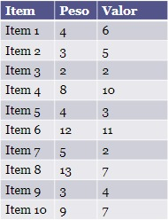

## 💻 Questão

- Sabendo que você só pode carregar no máximo 20kg e que cada item tem pesos e valores diferentes conforme a tabela.
- Use o algoritmo genético para escolher para carregar levando o maior lucro SEM passar do limite de peso.

  

