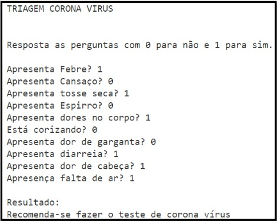
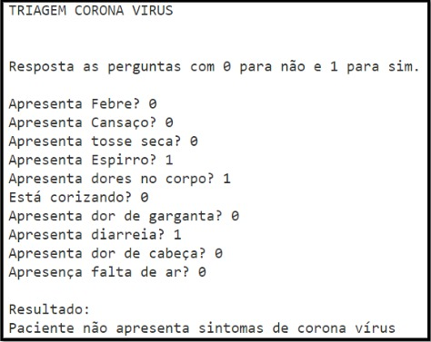

## 💻 Questão

- Durante o período em que o mundo passa pela Crise do Corona Vírus, um hospital solicitou que você desenvolvesse um algoritmo que faça a triagem dos pacientes que podem conter o corona vírus.
- Foi disponibilizado uma pequena base de dados no link abaixo com os sintomas dos pacientes representados por 1 (possui sintoma) ou o (Não possui o sintoma).
- `https://pastebin.com/raw/cGxtYihF`
- Crie o algoritmo com Machine Learning para classificar se o paciente possui ou não o risco de estar com o corona vírus, como nas imagens de exemplo.

  
  

