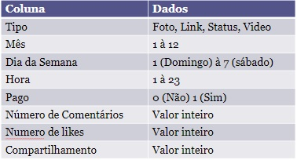
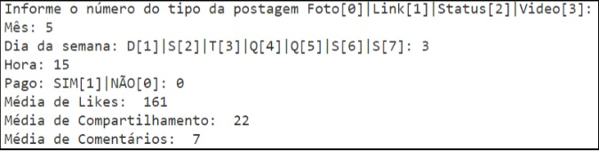

## 💻 Questão

- Sabendo que você está criando um algoritmo para uma empresa contendo dados de postagens no facebook, como apresentado no arquivo do [link](http://bit.ly/ml-r-q1).
- O arquivo contem os seguintes dados:

  

- Sabendo que Tipo de Postagem, Mês, Dia da Semana, Hora e Pago são atributos analisados e likes, compartilhamento e comentários são as respostas esperadas.
- Crie o modelo de regressão, e solicite ao usuário para informar os dados abaixo, dando uma previsão de likes, comentários e compartilhamento.

  

## Informações importantes

- Para rodar o projeto, antes de mais nada faça o clone do repositório
- Após clonar, entre no diretório `cd segundo_exercicio_ml`
- Certifique-se de ter o Python 3.x instalado
- Instale o Sklearn `pip install sklearn`
- Rode o projeto `python main.py`
